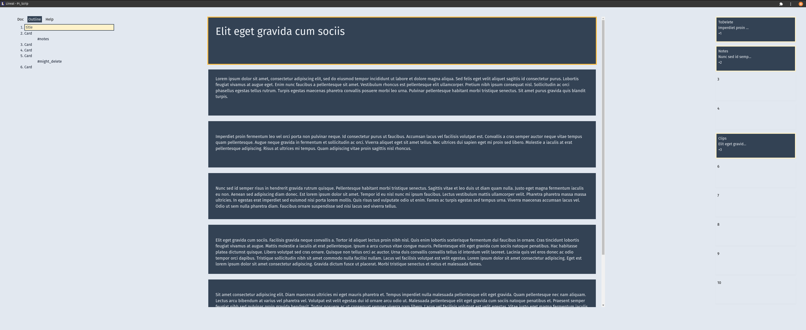
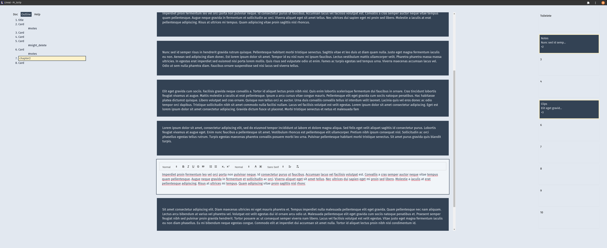
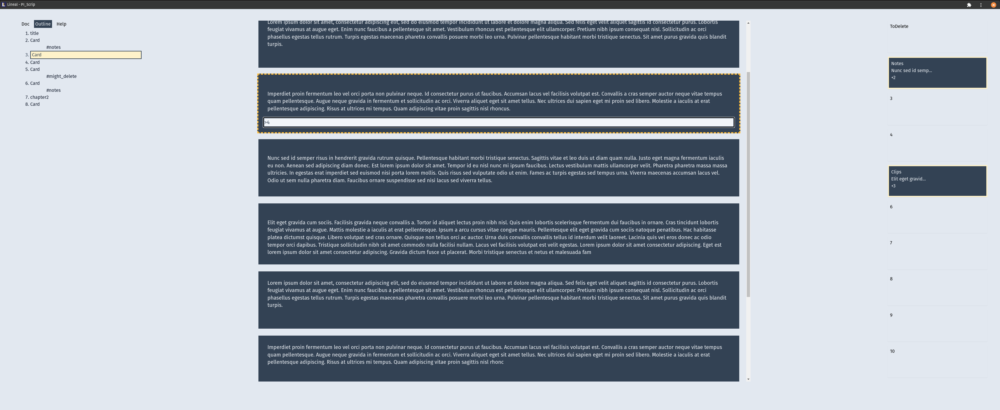
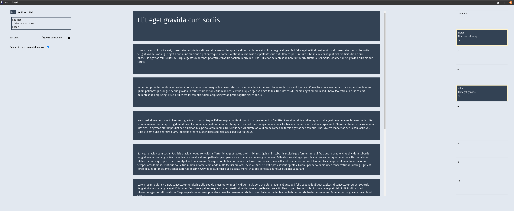
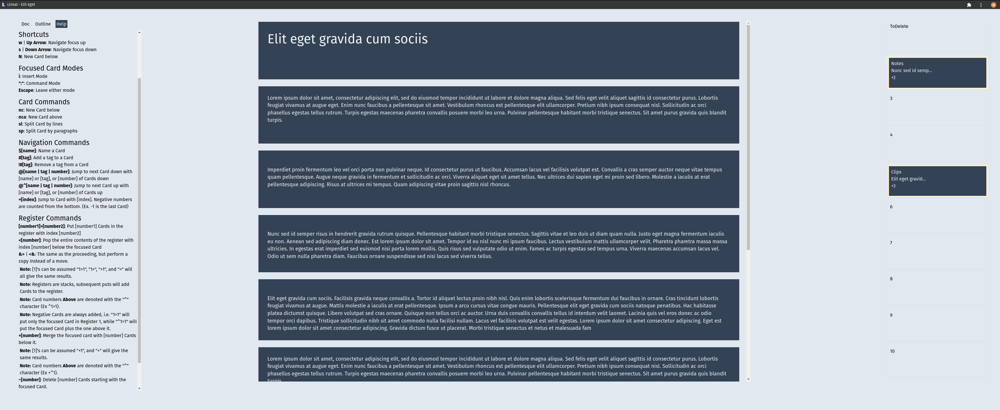

# Lineal
## Word processor and text editor that mimics writing on note cards.

Lineal is a word processing PWA that I developed to help me write fiction and whatnot. I wanted to do these things without being bogged down by that compulsion to edit _while_ writing, instead of just _writing,_ that apps like MS Word and GDocs can cause. It does this by using individual cards in a vertical line that you can use to treat your ideas and chunks of your writing in an atomic way, stopping you from seeing them as precious, or worse as a completed work. 

You can set cards aside in ten register stacks and pull them back anywhere in the document you want. You can hop around the document by naming individual cards and giving them tags and then jumping to them. You can split a card that's gotten too big by paragraphs, or even lines, then you can merge them back together. And you can do all of this with simple commands, so you can keep your hands on the keyboard. When you're done you can export the whole thing as a Word doc in .docx format.  

Here are some screenshots:

Normal Mode:

Edit Mode:

Command Mode:

Document settings:

Help screen:

If you're interested, sign up [here](https://lineal.app)
