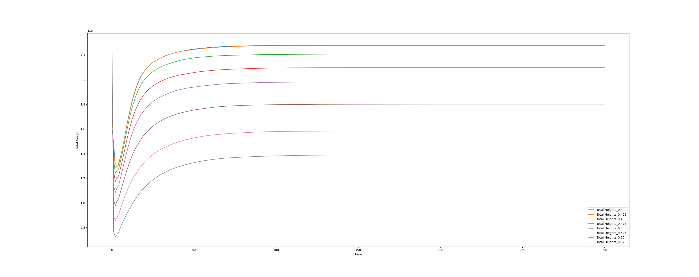

# Experiment 1 - Seed Probability

## Abstract

One of the most dynamic variables in the Conway's Bacteria system is the seed probability, or the probability of any cell being alive in the initial frame. After this initial 'sneeze' nothing else is different between the runs, but the evolution of the board in time is very different. Not only is the density of the board dependent on the initial seed, but so is the cross-section of that evolution.

## Fixed Setup

  Board Size: 2000 X 2000

  Max Height: 4

  Time Steps: 300

## Visual Inspection
These are a few 500 X 500 crops of the board at a few key seeds:

|10%|25%|
|---|---|
|||

|40%|55%|
|---|---|
|||


It may be hard to see here, but the major differences between the runs is apparent. They all start with the density one would expect, have an initial die off as they are bound by standard Game of Life rules before any colonies are formed, and then regain visible density as colonies start to form from the cells that survive the first die off.

Notice, though, that the 55% board never catches back up to the 40%, and this pattern you can see with your eye is confirmed by the plots.

## Initial Behavior

Starting by plotting the total height of all the cells on the board next to each other:


we can see how the initial peak starts at about the expected height, there is a die off, and then depending on the remaining density, there may be a anything from a slight recovery to an explosion. There does appear to be some strange behavior around the trough in the mid probabilities, almost like a shock wave. That will be something to look into later.

Now we can punch in on smaller ranges of probabilities.

### 5% to 12.5%


In this range you can see the effective minimum of around 10% where the board cannot bounce back from the initial die off, and the beginning of the range where there is an explosion after at 12.5%.

### 15% to 37.5%


This is a really interesting range, the initial step is higher than the sneeze, and after the die off, there's a shock wave, and then it explodes, but it remains positively related to the seed probability. This behavior does not last, though.

### 40% to 57.5%


### 40% to 57.5% - Zoomed


In these last two plots you may be surprised to see that the initial die off becomes more and more catastrophic, and it never recovers leading to the crossing of the plots we see in the second plot.

### Die Off Ratio


In this plot we have the ratio of the second frame total height to the first, with a Gaussian fit over top. You can see from that error range that it's not particularly normal, but for the sake of it, the fit returned 0.303 +- 0.007 for the mean probability and 0.156 +- 0.008 for the deviation.

### A Better View


In this contour plot you can see everything we've been talking about. The initial value is linear with the seed, there's the ridge at t = 1 centered around 30%, which expands to a saddle shape where 0 < t < 10. Also the ridge around 40% where the boards stabilize, which is our next topic.

## Stabilization

In the Bacteria rules colonies are totally stable, combine this with a finite board and density stabilization is inevitable, but I was interested to see if the seed probability would affect how fast the system would reach it. To do so I did a shrinking/rolling linear fit of the normalized total height and noted when it went to 0.0 +- 1e-6:

```python
oi = []
rs = []
x = ic.Branch('Time','f64',list(range(301)))
# Heights is a list of Branches of type ICalcify.FloatBranch of the total heights
for pro,hh in list(zip(probs,Heights)):
    std_buff = hh.branch/hh.branch.std()
    Z_branch = ic.Branch("Norm Height",'f64',std_buff - std_buff.mean())
    sc = x.against(Z_branch)   
    for i in x:
        try:
            if round(abs(
                  sc.cut(lambda t: t[0] >= i).fit(ic.fitting.linear).popt[0]
                ),6) == 0.0:
                oi.append(pro*100.0)
                rs.append(i)
                break
        except:
            continue
```
*Check out the Appendix for the rest of the notebook*

Plotting these we get:


and, boy, that's disappointing. Adding this to the contour, it's obvious there's not much structure in this dependency, if there even is one.


## Conclusion

The most interesting behavior we seem to be getting that depends on the seed probability is in the initial steps after the sneeze. The saddle that appears in the contour is very cool, indeed, but I wouldn't say that any of it is surprising. In the first 10 steps the vast majority of the board is following standard Game of Life rules and in a totally random sneeze if the initial density is above a certain level than a large portion of the board is going to be cleared for being over populated, until stable colonies start forming. It also makes sense that that level would be above 40% where the likelihood of a cell having more than 3 out 8 possible neighbors gets pretty high. Since a cell having exactly 4 cells in a specific configuration forms a colony, it looks like between 20% and 40% is the sweet spot for getting those colonies formed in the first step where a block of 9 cells goes from a total height of 5 to 6, offsetting the dying blocks.

## Future work

 1. Closer look at average density
 2. Closer look at how forming colonies in the first 10 steps plays a role in the shape of the distribution.  
