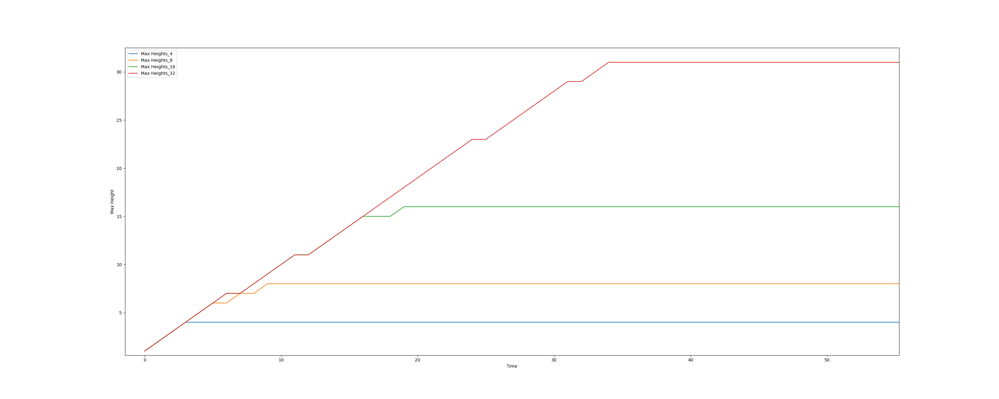

# Experiment 2 - Max Height

## Abstract

At the beginning of this project I had trouble settling on a maximum height for colonies. I ended up settling on 4 for the Seed Probability tests, but that was chosen arbitrarily for only two reasons. 1) It felt somewhat *natural* based on the standard GoL rules and 2) I didn't want to type any more RGB codes than that by hand into the source code for creating the gifs. Anyway, I found [this site](https://coolors.co/gradient-palette/ffffff-031a04?number=30) for creating gradient palettes and I was off to the races for finding the ideal max height.

## Fixed Setup

  Board Size: 2000 X 2000

  Seed Prob: 40%

  Time Steps: 300

## Visual Inspection
These are a few 500 X 500 crops of the board at all tested heights.

|4 - Standard|8|
|---|---|
|||

|16|32|
|---|---|
|||

I went with heights that were powers of 2 so that the pallets could stay sane in the code and I appended gold to the end to represent cells of the max height.

I'd like to draw everyone's attention to the 32 plot. Because of the large number of colors in the gradient the edges can be quite soft by comparison and I think they just look so organic, it's a stunning result considering the genesis of this [project](./#/Simulation/Conways_Bacteria/Introduction). Also, 32 had by far the most gold.

## Results
In contrast with the look of the gifs, the charts are much more underwhelming.

### Total Height

### Tallest Colony on the Board

I'm not sure there's anything interesting to say about these results, other than I guess it's good it behaves the way I expect. The total height of the board does increase with max height, but not in any interesting way; not quite linear, not quite log. And all of them reach their maximums somewhere on the board eventually, only missing the perfect 1:1 slope by a few frames with no increases.

I'm honestly a bit disappointed.

## Future work

I'm going to be taking a closer look at densities on the board, and try to get a better idea why `MAX_HEIGHT=32` had so many more gold cells.
